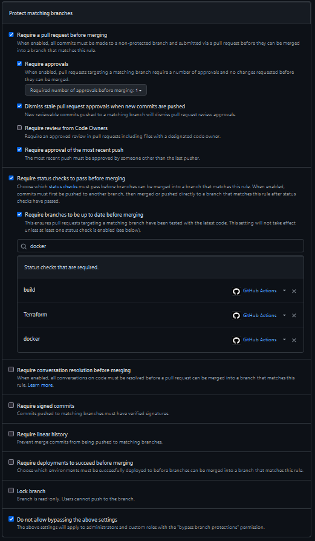

Kandidatnr: 1056

## Del 1 
### oppgave 1
#### spørsmål: 
Hva er utfordringene med dagens systemutviklingsprosess - 
og hvordan vil innføring av DevOps kunne være med på å løse disse? 
Hvilke DevOps prinsipper blir brutt?

#### svar:
DevOps kan løse mange av disse problemene Shopifly har i dag.
Et av prinsippene som blir brutt er WASTE, der det brukes mye tid på venting, delvis leveranse, mange ekstra prosesser og manuelle prosesser.
Andre prinsipper som blir brutt er continuous integration(CI)/continuous delivery(CD) vil løse mange av problemene de har i dag,
fordi CI ville ville validert koden/infrastrukturen sånn at main branchen ikke ville vært ødelagt/feile.
CD ville fikset det med å gjøre manuelle prosesser som manuelle deploys, og kan gjøre canary deployment eller
blå/grønn deploys som ruller tilbake vist det er mange feil/ eller andre metrics.
Et ting til som ville løst noen av problemene her er "Skin in the game"/"Asymmetri" som går ut på at 
vist du er med å utvikle det så er du også med på å drifte det også etter PR en er ferdig.


### oppgave 2
#### spørsmål:
En vanlig respons på mange feil under release av ny funksjonalitet er å
gjøre det mindre hyppig, og samtidig forsøke å legge på mer kontroll og QA.
Hva er problemet med dette ut ifra et DevOps perspektiv, 
og hva kan være en bedre tilnærming?

#### svar:
Hvorfor dette er et problem er at det gjør release syklusen lengre og det vil tilføre at feedback lupen tar lengre tid fra en gjør en endring til at den kommer ut i produksjon og brukere kan teste/bruke løsningen. Det vil føre til at det tar lengre til til man får feedback og kan fortsette og gjøre endringer som kunden bruker eller løse problemer/sårbarheter som oppstår i produksjon. Det går også under WASTE med ekstra prosesser. 
En bedre løsning kan være å ha feature flags til å skru av og på ny funksjonalitet eller ha blå/grønn deployments. Fordelen med det er at man putter ikke in ekstra prosesser men heller gjør løsningen mer solid, og mulig å gå tilbake til gamle versjoner/ skru av ny funksjonalitet som har problemer. Også et god ting til å løse dette problemet er å ha gode automatiserte tester, både unit tester, men også integrasjon tester og ende til ende(E2E) tester, samt andre test typer.


### oppgave 3
#### spørsmål:
Teamet overleverer kode til en annen avdeling som har ansvar for drift - 
hva er utfordringen med dette ut ifra et DevOps perspektiv, og hvilke gevinster kan man 
få ved at team han ansvar for både drift- og utvikling?

#### svar:
Utfordringen med det er at da har ikke utviklerne noe mer ansvar etter den har blitt levert til drift. Det fører ofte til at drift ikke god nok dokumentasjon om hvordan og kjøre det i prod, og utviklerne føler ikke sin egen smerte. Dette går på prinsippet "Skin in the game"/"Asymmetri", der ene siden ikke vet hva andre side gjør eller ikke må ta ansvaret for problemet.
Fordelen med at teamet har ansvar for både drift og utvikling betyr at personene må ta eget ansvar for løsningen og fører ofte til bedre kode/ mer stabilt produkt. Samt ikke noe "ikke mitt ansvar lenger" attende.


### oppgave 4
#### spørsmål:
Å release kode ofte kan også by på utfordringer. Beskriv hvilke- 
og hvordan vi kan bruke DevOps prinsipper til å redusere eller fjerne risiko 
ved hyppige leveranser.

#### svar:
Vi kan løse dette problemet ved å bruke continuous integration(CI) for å teste koden/infrastrukturen, samt med gode test verktøy og forskjellige test typer. Det fører selvfølgelig ikke til en skuddsikker  løsning men er et godt startpunkt. Andre ting vi kan bruke er Feature flags bak ny funksjonalitet som betyr at vi ka skru det av og på når en vi vil burke det, det fører også til at vi kan skru av en funksjonalitet fram til vi får ut en ny endring som fikser problemet. Den siste tingen vi kan bruker for å få det mere solid er å ha god continuous delivery(CD). Det fører til at vi kan deploye så mange ganger vi kan uten at det blir noe ulikt vist ikke det er gjort en endring, da er det også lurt å ha en deployment plan. Det vil føre til at vi kan rulle tilbake kjapt vist det er noe problemer.


## Del 2 - CI

### Oppgave 3
for å kunne sette opp branch protection må du være admin på repoet.
så må du gå inn /settings og så til branches på venstre side. 
der kan du velge main branchen, også kan du velge add branch protection rule.


så må du skrive inn i branch name pattern: main


så kan du velge disse reglene
- Require a pull request before merging
  - Require approvals before merging
    - Number of required approvals: 1
  - Dismiss stale pull request approvals when new commits are pushed
  - Require approval of the most recent push
- Require status checks to pass before merging
  - Require branches to be up to date before merging
  - need to add status checks
    - add status check: build
    - add status check: terraform
    - add status check: docker
- Do not allow bypassing the above settings


så kan du trykke save changes og da vil du ha branch protection på main branchen.


## Del 3 - Docker
### Oppgave 1
for at docker pipelinen skal kjøre må disse punktene være gjort.
- docker hub userName og password må ligge i github secrets på repoet.
- må bruke riktig jdk version i docker filen som pom.xml burker ex. "adoptopenjdk/openjdk11"
- må ha 2 steg for at docker/build-push-action@v3 skal fungere. [ref](https://github.com/docker/build-push-action#path-context)
  - docker/setup-qemu-action@v2 
  - docker/setup-buildx-action@v2

### Oppgave 3
Får å få docker image til å publishe til din egen ECR må du ha AWS_ACCESS_KEY_ID og AWS_SECRET_ACCESS_KEY i github secrets.
du må også ender env verdien "ECR_REGISTRY_NAME" i pipelinen til din egen ECR registry name.
så vil den publish til din egen ECR med sha tag og latest tag.


## Del 5
### Oppgave 1
Hoved problemet er at state filene som terraform lager blir ikke lagret på et felles sted, 
som vil si at når den kjører første gang går det helt fint.
Men de andre gangene så vet ikke terraform at den lagde en ressurs i AWS,
så den vil prøve å lage den samme ressursen igjen, men feile fordi en S3 bucket må ha unikt navn og er ikke stareless.
Så for å løse dette problemet må vi sette opp en felles s3 bucket som terraform kan lagre state filene sine i.
Det gjør man ved å legge til det i porvider.tf filen.
Da vil du ikke få feil når du kjører terraform apply flere ganger.
```terraform
terraform {
    required_providers {
    aws = {
      source  = "hashicorp/aws"
      version = "4.40.0"
    }
  }
  backend "s3" {
    bucket = "pgr301-2021-terraform-state"
    key    = "<name>/terraform.state"
    region = "eu-north-1"
  }
}
```